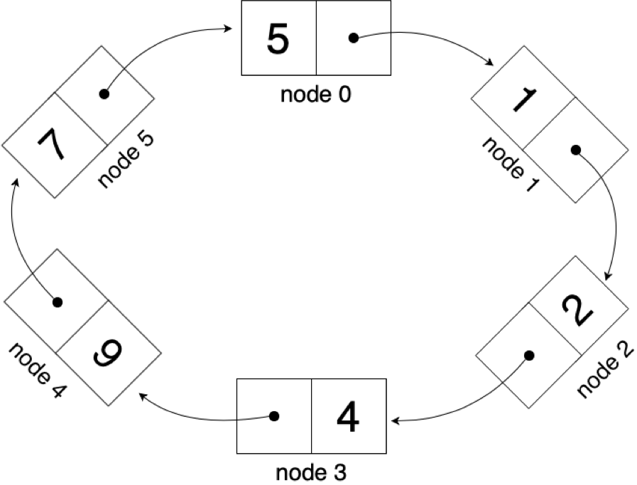

In a circular linked list the last node of the list **does not contain a reference or link to null**, but rather a **link to the first node (head)** of the list. Comparing the Circular Linked list to a common LinkedList we cant help but notice a few advantages such as the **ease of traversing** the List by starting from any point we choose, it can also be useful when *implementing a queue* because we can maintain a pointer to the last inserted node and the front can always be obtained as next of the last. Probably the most common application of a Circular Linked List is how applications run in a pc, as they are cycled to give them each a small amount of time to be executed by the processor.





## Example

This example demonstrates how to build a single-link circular linked list using **Python**

### Node class

Our Node class is the foundation on which we will build our linked list, so it is very important to define all the necessary attributes that we will use later one, in this case as an example we will only work with a parameter **id**, to store some kind of id (school id for example), but more parameters can be easily added, it is also important to note that we will begin to work with **links** or **pointers** at this time, and in our constructor we will assign this pointer to None (null) because we are not building the list just yet.

``` python
class Node:
    #Remember that we do not need to declare our class attributes
    #in Python, only assign those attributes through our constructor
    def __init__(self, id):   #constructor of class Node
        self.id = id          #assign the value sent as a parameter to our class atribute
        self.next = None      #assign the pointer link to None (null)
```

### CircularLinkedList class

Our circular linked list class is not more than a **collection of methods** utilized to alter in many different ways our circular linked list, here we can include methods such as: **add()**, **delete()**, **find()**, **traverse()**, **print_list()**, etc. in this example we will explore two methods: **add()** and **print_list()**, but more can be easily implemented, it is important to note that more often than note **recursion** is a good way of building this methods, although iteration tends to be faster, as this is a beginner example we will use iteration for the methods listed above.

``` python
class CircularLinkedList:
    def __init__(self):         #constructor of class CricularLinkedList
        self.head = None        #start our list empty, hence our head is None (null)

    #ADD method
    def add(self,node):
        if self.head is None:   #verify if our CircularLinkedList is empty
            self.head = node    #if is empty assign the first node to our head
            self.head.next = node    #by definition a CircularLinkedList next-link points to itself
        else:
            temp = self.head
            while temp.next is not self.head:    #iterate through our list until-
                temp = temp.next                 #-we reach the end of it
            temp.next = node                     #assign the pointer link of the last element to our new element
            node.next = self.head                #assign the next-link of the last node to the head of the CircularLinkedList

    #PRINT method
    def print_list(self):
        if self.head is None:               #verify if our CircularLinkedList is empty
            print('The list is empty')      #print a warning
        else:
            temp = self.head
            while temp.next is not self.head:    #iterate our list printing each element-
                print(temp.id,end='')            #-as we go
                print('->',end='')
                temp = temp.next
            print(temp.id,end='')                #print the las element in order to avoid [1->2->3->] the last link pointing tu None (null)
            print('->',end='')
            temp = temp.next
            print(temp.id)
```

### CircularLinkedList instance

Finally we create a new instance of out CircularLinkedList, add a couple of values and print our list to check if its working correctly (*note that we will be printing the head value last to debug that our list is working correctly*).


``` python
list = CircularLinkedList()     #create a new CircularLinkedList
list.add(Node(1))       #add element 1
list.add(Node(2))       #add element 2
list.add(Node(3))       #add element 3
list.print_list()       #print the list
```

### Output

Our output should look something like this.

``` bash
1->2->3->1
```
